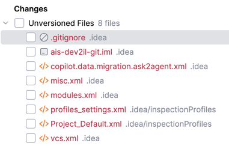

# 🥤 The AIS Survival Smoothie

In this tutorial, you will build a recipe for the "Ultimate AIS Survival Smoothie." 
You will learn how to use Git as a system to track your progress and navigate history using commits.

## Git Basics

### 🛠 Tools You'll Need
- **Terminal:** Terminal (Mac), GitBash (Windows).
- **Text Editor:**
   - **Mac:** TextEdit. Make sure that you are using plain text format (_Format > Make Plain Text_)
   - **Windows:** Notepad. Make sure that you are using plain text format
   - **For the Brave:** `vi` or `vim`. Use this option if you are comfortable with vi!

At some points, the terminal will ask for accepting input or let you scroll through the output.
- To scroll, use the up and down arrow keys. To stop scrolling, type `q` for quit.
- To accept input, type `:wq` (`:` = go to command mode, `w` = write, `q` = quit)

Maximising your learning effect: The commands are short and easy to type. You can also make use of the terminal's completion function. If you type instead of copy & pasting 
everything, your brain will grasp it deeper and you thus have a better learning experience. 

### Step 1: Tell Git Who You Are (Global Config)
Before we start, Git needs to know who is creating the commits. 
In Git, there are **system** settings (which are for every user and every repository on the entire computer), 
**global** settings (which are for your user only), 
and **local** settings (which are for this repository only). We will use the global settings.

```bash
git config --global user.name "Your Name"
git config --global user.email "your.email@example.com"
```

Also run this command. Just do it for now. We will understand it later on.
```bash
git config --global init.defaultBranch main
```

### Step 2: Create the Recipe Book
Create a new folder for your project and tell Git to start watching it.

```bash
mkdir survival-smoothie
cd survival-smoothie
git init
```

**👻 Where is my repository (the "Vault")?**

Git creates a hidden folder called `.git` to store your commits. To see the "invisible" magic, try this: `ls -la`

⚠️ Note: **Never** delete or fiddle around with the `.git` folder manually. If you delete it, your entire project history (your time machine) is gone!

### Step 3: Create the Recipe

1. Create a file named `README.md` and add your first ingredient: `2x Bananas`.
1. Go back to your terminal and check the status: `git status`.

🔍 Git sees the file but calls it **untracked**. It’s in the room, but not "on the stage" yet.

Move it to the Staging Area:
```bash
git add README.md
git status
```

📦 The file is now **staged**. It's ready for the commit.

### Step 4: Your First Version of the Recipe

A commit is a permanent save-point of your work. The message is the most important part because it tells your future self what you did.

🚫 **The "Wall of Shame"**

Do not use messages like these:
- _update_
- _fixed stuff_

✅ **The "Professional Way"**

A good message is short and describes the __intent__.

`git commit -m "Add base ingredient: bananas"`

**Our Timeline Now**

```
v1 (HEAD) Add base ingredient: bananas
```

❓ What is `HEAD`?

A pointer that says _"You are here"_. It points to the specific commit you are currently looking at.

### Step 5: Expand the Recipe

Add `1x Scoop Protein Powder` to your `README.md`.

Now, let's see **WHAT** changed in the workspace before we stage it:

```bash
git diff
```

🔍 Lines starting with `+` are the additions since your last commit.

Stage and commit again:

```bash
git add README.md
git commit -m "Add protein for brain power"
```

💡`git diff` shows the changes in your workspace that are not yet staged! If you want to see all the changes since the last commit, including staged changes, use `git diff HEAD`.

**Our Timeline Now**

```
v2 (HEAD) Add protein for brain power
v1 Add base ingredient: bananas
```

### Step 6: Quick History Check

Use a one-line view to see your current progress.

`git log --oneline`

Each commit is identified by a unique commit hash, aka a _Commit SHA_. It is a unique, 
40-character string that acts as a fingerprint for a specific snapshot of your project.
You rarely need to use all 40 characters. In most commands, you can just use the first 
7 characters. Git is smart enough to find the right commit as long as those 7 characters 
are unique within your repository.

### Step 7: Inspecting the History in More Detail

Now, let’s look at the full record to see the **Who**, **When**, and **Why**.

`git log`

If you also want to see the **What** use: `git log -p`.

⚠️ You might need to hit `q` to exit the log view.

### Step 8: Compare Two Points in Time

Sometimes you want to see exactly what changed between the very first version and the latest version.

Find the hashes for two versions and compare them using

```bash
git diff <hash-of-v1> <hash-of-v2>
```

### Step 9: The "Oops Moment"

**Scenario A: The Protein was a mistake (Revert)**

You want to remove the protein, but you want to keep the history of that mistake for the record. This creates a new commit.

```bash
git revert HEAD --no-edit
```

💡If you use the `--no-edit` flag, then Git will not open your default editor to ask you for a commit message, but creates a default one instead.

**Our Timeline Now**

Use what you've already learned to inspect the timeline starting from here!

**Scenario B: Emergency Stop (Reset)**

Your recipe is a mess. You want to **delete** everything and go back to an older version as if nothing else happened.

1. Find the hash of your first commit
1. Reset the timeline

```bash
git reset --hard <hash-of-v1>
```

⚠️ Warning: Newer commits are now gone! Be very careful with this command!

💡If you want to throw away all your changes that you currently have in the workspace, but not 
delete any commits, use `git reset --hard HEAD` (remember `HEAD` is just a pointer to the latest commit). 

💡If you want to go back to a commit, but don't want to lose the changes, use `git reset --soft <hash-of-v1>`.
This will delete the commits but at the same time keep the undone changes in your workspace.

### 🏆 Summary Cheat Sheet

| Command                | What it does                             | Metaphor                                                                                             |
|:-----------------------|:-----------------------------------------|:-----------------------------------------------------------------------------------------------------|
| `git init`             | Creates a new repository                 | Build the vault                                                                                      |
| `git status`           | Shows changed workspace and staged files | Check what's already in the box to be shipped. Also shows what you probably want to put into the box |
| `git add`              | Stages a file                            | Put something into the box to be shipped                                                             |
| `git commit`           | Creates a commit                         | Seal the box and put it into the vault                                                               |
| `git log`              | Shows commits                            | Show all the boxes in the vault                                                                      | 
| `git diff HASH1 HASH2` | Compares two commits                     | Show the difference of two boxes in the vault                                                        |
| `git revert`           | Undoes changes                           | Undo the changes that are in a box and put the changed one into the vault                            |
| `git reset --hard`     | Destroys changes                         | Remove boxes from the vault and throw them away                                                      |              
| `git reset --soft`     | Destroys changes                         | Remove boxes from the vault, but keep the contents of the box in your workspace                      |              


### 🚀 Level Up

Finished early? Put your Git skills to the test with these "Pro" moves.

**Challenge 1: The "Forgetful" (Amending)**

Imagine you committed v1, but realized you had a typo or forgot to add a 
`CONTRIBUTORS.txt` file. You don't want a new version; you want to fix the last one.

- Create a file `CONTRIBUTORS.txt` with your name
- Stage it
- Instead of a new commit, run `git commit --amend -m "Add bananas and contributor list"`

**Challenge 2: "Pick-and-Choose" (Selective Staging)**

Sometimes you change multiple files, but you only want one of them to be in the next commit.

- Create `strawberries.txt` and `blueberries.txt`
- Run `git status`. Both are untracked.
- Stage only the `strawberries.txt`

Run git status again. Notice how one is staged and the other isn't!

**Challenge 3: The "Deep Clean" (Cleaning)**

Your workspace is getting messy with "trash" files (like `test.txt`) that you never added to Git.

- Create a trash file `junk.txt` in your workspace 
- Check the status to verify that it's untracked
- To delete all untracked files in one go, run `git clean -f` 

⚠️ Warning: Your files will be gone! Be very careful with this command!

**Challenge 4: "Who added rotten bananas to my smoothie ?" (Blaming)**

Git can tell you exactly who wrote which line in a file.

`git blame README.md`

💡 In high-performing DevOps teams, they practice "Blameless Post-Mortems". 
The goal is never to punish the person who made the mistake, but to fix the process 
that allowed the mistake to happen. `git blame` is simply a map to find the person 
who can help explain what happened here.

## Branching and Merging (The Multiverse)

Up until now, we have been working on a single timeline called `main`.
In a team, multiple people work on different features at the same time. If everyone commits to
the same timeline, chaos ensues!

To solve this, we use **branches**. Think of them as parallel universes where you can experiment
safely without breaking the main recipe.

💡Run `git status` to see which branch you are currently on.

### Daily Workflow - Step 1: Start a Task (Create a Branch)

You pick a ticket to work on. You want to add a new ingredient: **Blueberries**.
Instead of adding it directly to the main recipe, you create a dedicated branch.

```bash
git branch feature/blueberries
git checkout feature/blueberries
```

Or simpler (create and switch in one go):

```bash
git checkout -b feature/blueberries
```

### Daily Workflow - Step 2: Work and Commit

Now you are in the `feature/blueberries` universe. Check `git status` to see that you are actually on the branch!

1. Edit `README.md` and add `A Handful of Blueberries`.
2. Save the file.
3. Commit your changes to this branch.

```bash
git add README.md
git commit -m "Add antioxidants (blueberries)"
```

### Daily Workflow - Step 3: Bring it Back (Merge)

Your task is done and the blueberries look delicious. It's time to bring your changes back to the main timeline
so everyone can enjoy them.

1. Switch back to the main timeline
```bash
git checkout main
```

💡Git does not mandate how your main timeline is called. In fact, it's simply yet another branch. By default, Git calls this branch `master`, but 
many teams use `main` instead (this is e.g. the convention and default in GitHub). It's now time to remember the command 
`git config --global init.defaultBranch main` you used at the beginning of this session. Figure out on your own what it did.

2. Merge your feature branch into the main timeline
```bash
git merge feature/blueberries
```

3. Delete the branch. The feature is now part of the product. You don't need the working branch anymore.
```bash
git branch -d feature/blueberries
```

### 🚀 Level Up

Finished early? Ready for the real world? Things don't always go this smoothly.

**Challenge 1: The "Clash of Ingredients" (Merge Conflicts)**

What happens if two people change the **same line** at the same time?

1. Create a new branch `feature/bananas` and switch to it.
2. Change the line `2x Bananas` to `3x Bananas` in `README.md`.
3. Commit the change.
4. Switch back to `main` (don't merge yet!).
5. Change the line `2x Bananas` to `1x Banana` in `README.md` (directly on `main`).
6. Commit the change.
7. Now try to merge the branch: `git merge feature/bananas`.

💥 **BOOM! Conflict!**

Git will tell you that there is a conflict. Open `README.md` in your text editor. You will see something like this:

```text
<<<<<<< HEAD
1x Banana
=======
3x Bananas
>>>>>>> feature/milk
```

- Decide which version is correct (or combine them).
- Remove the markers `<<<<<<<`, `=======`, `>>>>>>>`.
- Save the file.
- `git add README.md`
- `git commit` (no message needed, Git creates a default one)

💡After resolving the conflict and saving, type `:wq` in vi to exit and save. 
If using another editor, follow its save/close instructions.

**Challenge 2: "Hold my beer" (Stashing)**

You are working on a new branch `feature/spinach` and have made some experimental changes (you modified the file but didn't commit yet).
Suddenly, your boss shouts: "STOP! We need to fix a bug on our trunk immediately!"

You can't switch branches because you have uncommitted changes that would be overwritten. You don't want to commit half-finished work.

Solution: **The Stash** (a temporary clipboard for your files).

1. Make a change to `README.md` but **do not** commit it.
2. Run `git stash` to save your work on the side.
   - Your workspace is clean again (check with `git status`).
3. You can now switch branches, do other work, etc.
4. When you are ready to continue, run `git stash pop`.
  Your changes are back!

💡Git can stash multiple changes. Run `git stash --help` to get more information. 

**Challenge 3: "Ghost Writer" (Patches)**

Sometimes you want to send a change to a friend without committing it to the repository (e.g. via email or chat).

1. Make a change to `README.md` (e.g. Add "Secret Sauce"). **Do not** commit it.
2. Create the patch file:
   ```bash
   git diff > secret.patch
   ```
3. Check the content of the file: `cat secret.patch`
4. Undo your changes in the workspace so we can simulate receiving the patch (remember the `git reset` command ?)
5. Apply the patch:
   ```bash
   git apply secret.patch
   ```
6. Check `git status` and `cat README.md`. Your changes are back!

## Working Remotely as a Team (GitHub)

Up to now, we have been working locally. Now let's start to collaborate!
In this section, you will work in pairs. One of you is **Person A**, the other is **Person B**.

### Step 1: Setup the Team Repository

1. **Person A**: Create a new repository on GitHub called `survival-smoothie-team`.
   - **Important**: Do not initialize it with README, .gitignore or License. We want an empty repository because we will push our existing local repository to it.
2. **Person A**: Invite **Person B** as a collaborator (_Settings > Collaborators_).
3. **Person A**: Link your local repository to GitHub.
   ```bash
   git remote add origin https://github.com/<YOUR-USERNAME>/survival-smoothie-team.git
   git push -u origin main
   ```
   ❓ **What is `origin`?**
   It is the standard nickname for your remote repository (the server). Instead of typing the full URL every time, you just refer to it as `origin`.

   ❓ **Why `-u origin main`?**
   - `main`: Since the remote repository is completely empty, Git doesn't know which branch you want to push. You have to explicitly say "take my local main branch and put it there".
   - `-u` (upstream): This tells Git to remember this connection. For all future pushes, you can simply type `git push`, and Git will know you mean "push main to origin".
4. **Person A/B**: Browse the _Code_ of your repository on GitHub.
5. **Person B**: Clone the repository to your machine.
   **Note**: You need to clone it into a **new** folder, separate from your previous local practice folder.
   ```bash
   git clone https://github.com/<PERSON-A-USERNAME>/survival-smoothie-team.git survival-smoothie-team
   cd survival-smoothie-team
   ```

### Step 2: The Synchronization Dance (Push & Pull)

Git is a distributed system. You have your version, your partner has theirs, and GitHub has the "truth" in the cloud.

To share your work:
- `git push`: Send your commits up to the cloud.
- `git pull`: Download new commits from the cloud.

**Workflow:**

1. **Person A**: Add a new file `shopping-list.txt` with some content and commit it.
2. **Person A**: Run `git push` to upload the changes.
3. **Person B**: Run `git pull` to get the file. Check your folder to see `shopping-list.txt`.

### Step 3: Peer Reviews (Pull Requests)

Professional teams rarely push directly to `main`. They use **Pull Requests (PRs)** to discuss changes before merging.
This process allows for code review, ensuring quality and sharing knowledge.

**The Task: Add Honey**

1. **Person B**: Create a new branch `feature/honey`.
2. **Person B**: Add "1 tbsp Honey" to the recipe in `README.md`. Commit the change.
3. **Person B**: Push the branch to GitHub.
   ```bash
   git push -u origin feature/honey
   ```
4. **Person B**: Go to the GitHub repository page in your browser. You should see a prompt to create a **Pull Request**. Create it.

   ❓**What makes a great PR?**
   > *"A great PR tells a story."* — The DevOps Handbook
   - **Context**: Explain **why** you made the change (the story), not just **what** you did.
   - **Size**: Keep it small. Easy to review = Fast to merge.
   - **Validation**: Prove it works! Add e.g. test results (a lot more on this later in our sessions)

5. **Person A**: Go to GitHub, click on the **Pull Requests** tab. Open the PR created by Person B.
   - Review the changes (_Files changed_ tab).
   - Leave a comment.
   - Click **Review changes** and select **Approve**.

   ❓**What makes a good review?**
   > *"A good review is a peer-to-peer conversation to improve quality."* — The DevOps Handbook
   - **Focus on Logic**: Don't nitpick formatting/style (use tools for that).
   - **Be Kind**: Critique the code, not the person.
   - **Ask Questions**: "Why did you choose X?" instead of "Change X to Y".
   - **Praise**: Highlight good ideas! Comments like "Yummy!" boost motivation. 

6. **Person A**: Click **Merge pull request** and delete the branch.
7. **Both**: Switch back to `main` locally and `git pull` to synchronize the merged changes.
   ```bash
   git checkout main
   git pull
   ```

### 🚀 Level Up

Finished early? Try these advanced GitHub moves.

**Challenge 1: "None Shall Pass" (Branch Protection)**

Chuck Norris protects his `main` branch, even though bugs are too scared to push.

1. Go to your repository **Settings > Branches**
2. Use **Add classic branch protection rule** to create a rule for the `main` branch.
3. Check **Require a pull request before merging**.
   - **Important**: Check **Do not allow bypassing the above settings** so the rule applies to you (the owner) too!
   - **Important**: GitHub sets the option **Require approvals** to 1 by default. Uncheck it to keep things simple for now.
4. Try to push directly to `main` from your terminal. It should fail!

**Oops! Stuck on main?**

You now have a commit on your local `main` branch that you cannot push. 
Let's fix this by moving your changes to a new branch:

1. Undo the last commit but keep the changes staged (Soft Reset) 
```bash
git reset --soft HEAD~1
```
💡`HEAD~n` references the n-th commit before HEAD. Here, we go back 1 commit. You can also add a commit hash instead.

2. Switch to a new branch (takes the staged changes with you)
```bash
git checkout -b rescue-mission
```

3. Stage, commit on and push the new branch 🥳 
```bash
git add .
git commit -m "..."
git push -u origin rescue-mission
```

**Challenge 2: "The Magic Link" (Issues & PRs)**

Teams use issues to track bugs, feature requests, and tasks in a shared, organized way. This helps everyone stay aligned, ensures nothing is forgotten, and makes collaboration transparent and efficient.

1. Create a GitHub Issue "Add more vitamins". Note the issue number (e.g. #1).
2. Create a branch, add a vitamin to the recipe.
3. When opening the PR, write "Closes #1" in the description.
4. Merge the PR and watch what happens to the issue automatically.

**Challenge 3: "Conflict in the Cloud"**

When Chuck Norris merges a pull request, even merge conflicts resolve themselves out of fear.

1. Both Person A and Person B create a new branch from `main`.
2. Both modify the **same line** in the README and commit the change.
3. Both push their branch and open a PR.
4. Person A merges their PR first.
5. Person B will now see a conflict in their PR.
6. Resolve the conflict directly in the GitHub UI and merge.

## Making Your Life Easier in Day-to-Day _Gitting_

Git is "CLI-first". You can do everything using the CLI, which makes it the perfect candidate for 
automating tasks. This also means that you can use Git in any environment where a command line and 
the `git` tool is available. 

In daily work, most developers use an IDE (Integrated Development Environment), which tremendously 
increases UX. Just imagine having to analyze the output of `git diff` for many files and changes 😱.

- Start PyCharm
- Open the `survival-smoothie` folder as a project
- Open the _Commit Tool_ 
- You will see something like this 


### 🙈 Ignoring Unwanted Files (.gitignore)

When you open the project in PyCharm, it creates a hidden folder called `.idea`. This contains your 
personal IDE settings. Accept for the moment that you don't want to share these with your team.

**Rule of Thumb:**
- **Commit:** Source code (recipes in our case), shared config.
- **Do not commit:** IDE settings (`.idea`, `.vscode`), temporary files, build results and secrets.

To stop Git from tracking these, use a `.gitignore` file.

1. Create a file named `.gitignore` in your project root.
2. Add the following line to it:
   ```text
   .idea
   ```
3. Commit the `.gitignore` file using the _Commit Tool_. Just follow your knowledge and intuition. 

### Using Your IDE "to git"

All IDEs usually have great support for Git! In PyCharm, you can, e.g. use the 
_Commit Tool_  or the _Git_ Tool
. Also the _Project Tool_ 
is going to augment your project with Git information. 

You already know everything you need! Follow your intuition to complete the following tasks:
- Create a new file, stage it and commit
- Add a new ingredient to our smoothie recipe and commit it
- Find and inspect the history of your commits (who, what, when, why) 
- Compare two commits
- Revert a commit
- Reset your project to a previous state
- Create a feature branch, work on it and merge it back into the trunk
- Create a merge conflict and resolve it

💡Hints
- If you can't find a tool use _View > Tool Windows_
- If you are searching for an IDE action, try _Navigate > Search Everywhere > Actions_ 

### 🚀 Level Up

Finished early? Put your IDE skills to the test with these "Pro" moves.

- Try to amend your last commit
- Modify two files. Commit the two files individually
- Open the `README.md` file and try to achieve these tasks using the _Git_ actions in the context menu
  - Activate the _Blame_ (_Annotate_) mode
  - Show the history only for this file
  - Put the cursor in the first line and find only the changes done to exactly this line
- You've messed up something but have no commit? Check out the _Local History Tool_. 
  ⚠️ Warning: This is not a Git feature
- PyCharm can also "stash" changes for you. Check out _Shelve Changes_ in the _Commit Tool_.
  ⚠️ Warning: This is not a Git feature
- Try to create a patch file from the _Commit Tool_ and the history in the _Git_ tool
- Compare the contents of branches: 
  - Find out which commits exist on a branch but not on the trunk
  - Find out which files and lines are different between the latest version of a branch and the trunk
  
## Further Readings

- https://training.github.com/downloads/github-git-cheat-sheet/
- https://skills.github.com/
